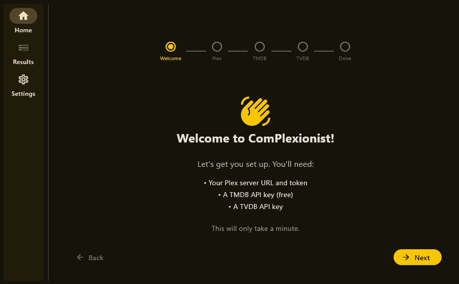
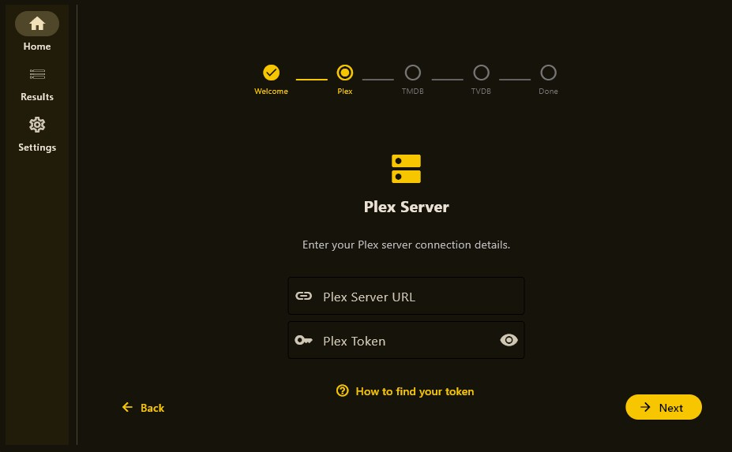
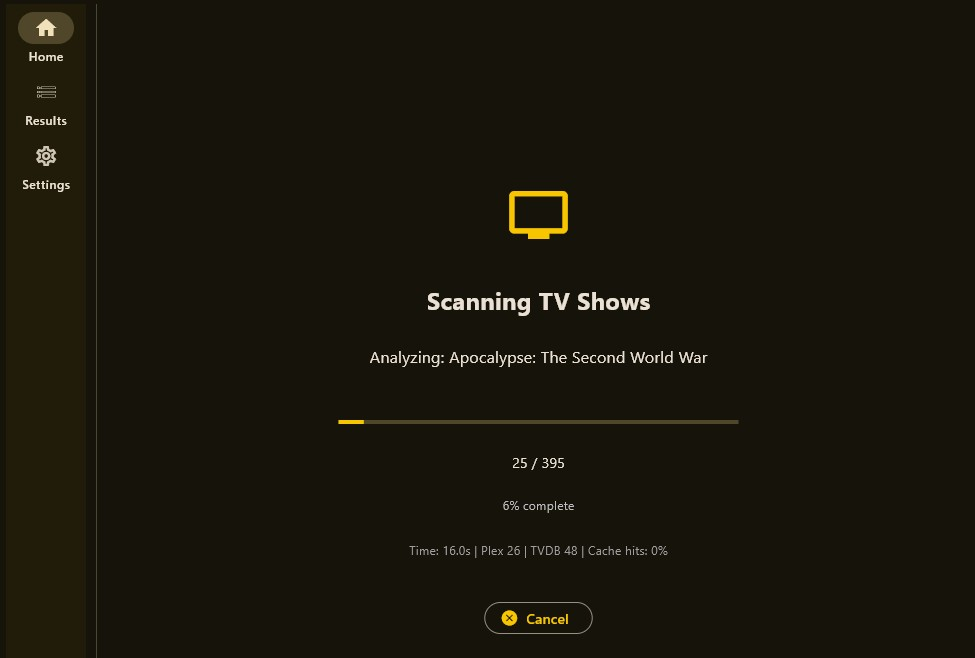
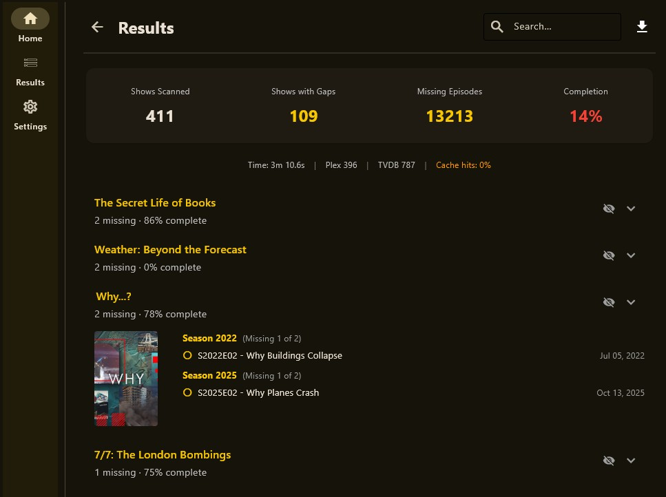
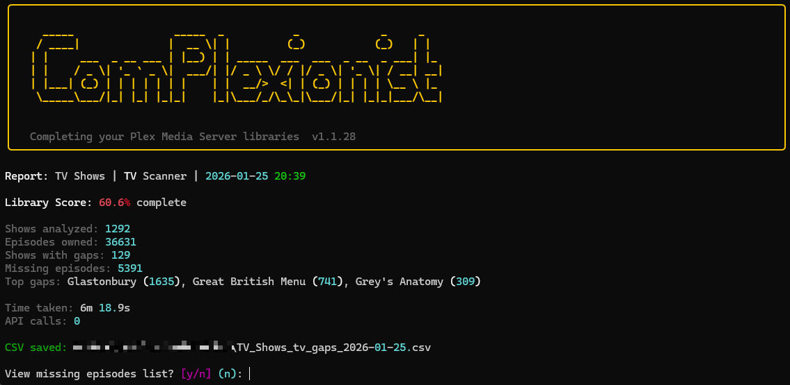

# ComPlexionist

[](https://github.com/The-Ant-Forge/ComPlexionist/actions/workflows/ci.yml)
[](https://github.com/The-Ant-Forge/ComPlexionist/actions/workflows/build.yml)




Completing your Plex Media Server libraries.

## Features

### Desktop GUI (v2.0)
ComPlexionist now includes a full graphical user interface built with Flet:
- **Dashboard** with connection status indicators and quick scan buttons
- **Multi-server support** - configure and manage multiple Plex servers
- **Scanning screen** with live progress, API stats, and cancel button
- **Results display** with search, filtering, and grouped collections/shows
- **Ignore functionality** - click to ignore collections or shows directly from results
- **Export** to CSV, JSON, or clipboard
- **Settings panel** with server management, credential editing, and ignore list management
- **Window state persistence** - remembers size and position

The GUI is the default mode when you run the executable without arguments.

### Movie Collection Gaps
Plex automatically creates Collections when you own movies that belong to a franchise (e.g., "Alien Collection", "Star Wars Collection"). However, Plex doesn't tell you which movies from those collections you're missing.

ComPlexionist solves this by:
- Scanning your Plex movie library collections
- Cross-referencing with TMDB (The Movie Database) to get the complete collection
- Listing all missing movies from each collection
- Showing which movies you already own (with green checkmarks)
- Allowing you to **ignore collections** you don't want to complete
- **Organizing scattered movies** into collection folders with one click

### TV Episode Gaps
For TV show libraries, ComPlexionist identifies missing episodes:
- Scans your Plex TV library for series
- Cross-references with TVDB for complete episode listings
- Reports missing episodes by season with episode titles
- Handles multi-episode files (S02E01-02, S02E01-E02, etc.)
- Allows you to **ignore shows** you don't want to track

### Caching
API responses are cached to reduce redundant calls and speed up subsequent scans:
- TMDB movie/collection data: 7-30 days (conditional based on collection status)
- TVDB episode data: 24 hours
- Cache stored next to config file (or exe) as human-readable JSON
- Automatic invalidation when library content changes

## Quick Start

### Download and Run (Windows)
1. Download `complexionist.exe` from the [latest release](https://github.com/The-Ant-Forge/ComPlexionist/releases)
2. Run the executable - the GUI will launch automatically
3. If no configuration exists, the setup wizard will guide you through entering your credentials

### First-Run Setup



The setup wizard will prompt for:
- **Plex server URL** and **token** ([how to find your token](https://support.plex.tv/articles/204059436-finding-an-authentication-token-x-plex-token/))
- **TMDB API key** ([register free](https://www.themoviedb.org/settings/api))
- **TVDB API key** ([register](https://thetvdb.com/api-information))

All credentials are validated live as you enter them.

## Prerequisites

- Windows 10 or 11 (for standalone executable)
- Python 3.11+ (for source installation)
- Plex Media Server with configured libraries
- API keys: Plex token, TMDB API key, TVDB API key

## Installation

### Option 1: Standalone Executable (Recommended)
Download `complexionist.exe` from the [releases page](https://github.com/The-Ant-Forge/ComPlexionist/releases). No installation required.

### Option 2: From Source
```bash
# Clone the repository
git clone https://github.com/The-Ant-Forge/ComPlexionist.git
cd ComPlexionist

# Create virtual environment and install
python -m venv .venv
.venv/Scripts/activate  # Windows
# source .venv/bin/activate  # Linux/Mac

pip install -e ".[dev]"
```

## Usage

### GUI Mode (Default)


Simply run the executable without arguments to launch the graphical interface:
```bash
complexionist          # Launches GUI (default)
complexionist --gui    # Explicitly launch GUI
```


### CLI Mode
Use the `--cli` flag or any subcommand to use the command-line interface:
```bash
complexionist --cli              # CLI interactive mode
complexionist movies             # Scan movies (CLI)
complexionist tv                 # Scan TV shows (CLI)
complexionist scan               # Scan both (CLI)
complexionist movies --server "4K Server"  # Scan specific server
```




### Find Missing Movies (CLI)

```bash
# Scan movie library for collection gaps
complexionist movies

# Scan specific library (by name)
complexionist movies --library "Movies 4K"

# Include unreleased movies
complexionist movies --include-future

# Output as JSON
complexionist movies --format json

# Skip small collections (less than 3 movies)
complexionist movies --min-collection-size 3

# Only show collections where you own at least 3 movies
complexionist movies --min-owned 3

# Use GUI-managed ignore list (skip ignored collections)
complexionist movies --use-ignore-list

# Suppress automatic CSV output
complexionist movies --no-csv
```

### Find Missing TV Episodes (CLI)

```bash
# Scan TV library for episode gaps
complexionist tv

# Scan specific library (by name)
complexionist tv --library "TV Shows 4K"

# Include specials (Season 0)
complexionist tv --include-specials

# Include unaired episodes
complexionist tv --include-future

# Exclude specific shows
complexionist tv --exclude-show "Daily Talk Show"

# Skip recently aired (within 48 hours)
complexionist tv --recent-threshold 48

# Use GUI-managed ignore list (skip ignored shows)
complexionist tv --use-ignore-list

# Suppress automatic CSV output
complexionist tv --no-csv
```

### Scan Both Libraries (CLI)

```bash
complexionist scan
complexionist scan --use-ignore-list
```

### Cache Management (CLI)

```bash
# View cache statistics
complexionist cache stats

# Clear all cached data
complexionist cache clear

# Force refresh (invalidate fingerprints)
complexionist cache refresh
```

### Configuration Commands (CLI)

```bash
# Show current configuration
complexionist config show

# Show config file paths
complexionist config path

# Run interactive setup wizard
complexionist config setup

# Validate configuration (dry-run)
complexionist movies --dry-run
```

### Common Options (CLI)

```bash
# Quiet mode (no progress indicators)
complexionist -q movies

# Verbose mode
complexionist -v movies

# Dry-run mode (validate config without scanning)
complexionist movies --dry-run

# Output formats: text (default), json, csv
complexionist movies --format json
complexionist tv --format csv

# Select a specific Plex server (by name or index)
complexionist movies --server "4K Server"
complexionist tv --server 1
```

## Configuration

### Configuration File
Create a `complexionist.ini` file (next to the exe, in current directory, or in `~/.complexionist/`):

```ini
[plex:0]
name = Main Server
url = http://your-plex-server:32400
token = your-plex-token

# Add more servers:
# [plex:1]
# name = 4K Server
# url = http://your-4k-server:32400
# token = your-4k-token

[tmdb]
api_key = your-tmdb-api-key
# Ignored collections (TMDB IDs) - managed via GUI ignore button
# ignored_collections = 8091,748  # e.g., Alien, Terminator

[tvdb]
api_key = your-tvdb-api-key
# Ignored shows (TVDB IDs) - managed via GUI ignore button
# ignored_shows = 71663,81189  # e.g., The Simpsons, Breaking Bad

[options]
exclude_future = true
exclude_specials = true
recent_threshold_hours = 24
min_collection_size = 2
min_owned = 2

[window]
# Managed by GUI - saves window size/position
```

See `complexionist.ini.example` for a full template with comments.

## Example Output





```
Movie Collection Gaps - Movies

Summary:
  Movies scanned: 1,234
  In collections: 89
  Collections with gaps: 12

Alien Collection (missing 2 of 6):
  - Alien3 (1992)
  - Alien Resurrection (1997)

Terminator Collection (missing 1 of 6):
  - Terminator: Dark Fate (2019)
```

## Documentation

- [Plex Background Research](docs/Plex-Background.md) - Technical details about Plex API
- [Specification](docs/Specification.md) - Feature specs and architecture
- [Completed Work](docs/Completed.md) - Development history

## License

MIT

## Acknowledgments

- [Plex](https://www.plex.tv/) - Media server platform
- [TMDB](https://www.themoviedb.org/) - Movie metadata
- [TVDB](https://thetvdb.com/) - TV show metadata
- [python-plexapi](https://github.com/pkkid/python-plexapi) - Python bindings for Plex API
- [Flet](https://flet.dev/) - Python GUI framework
